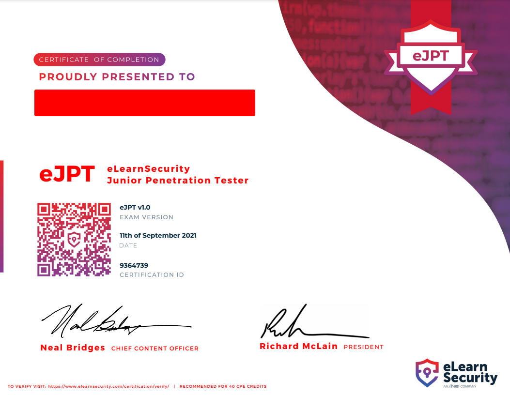
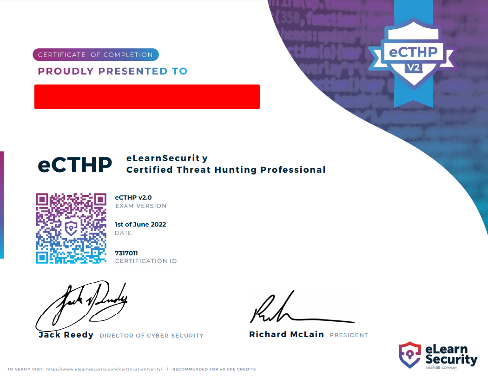
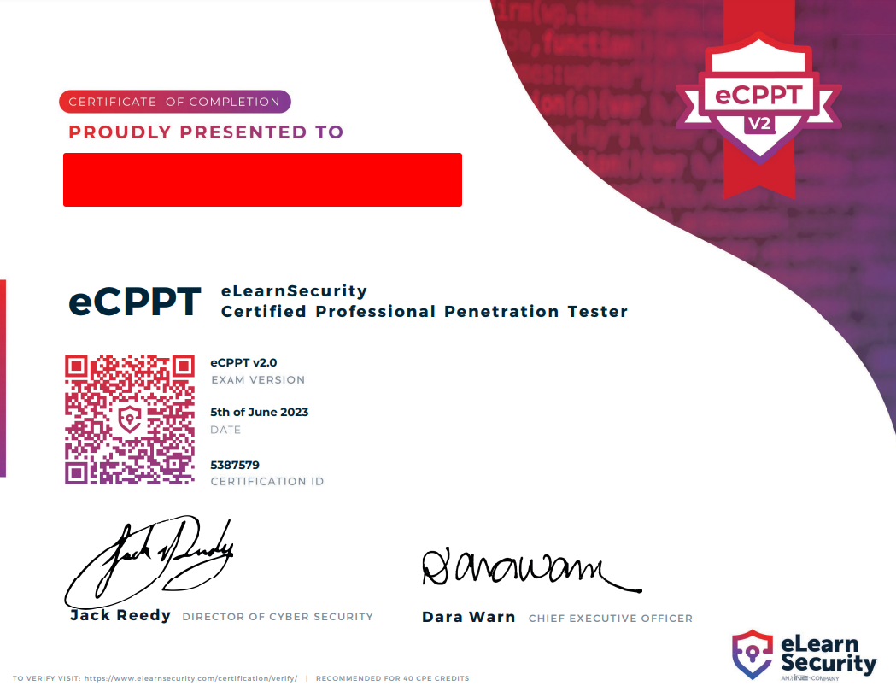
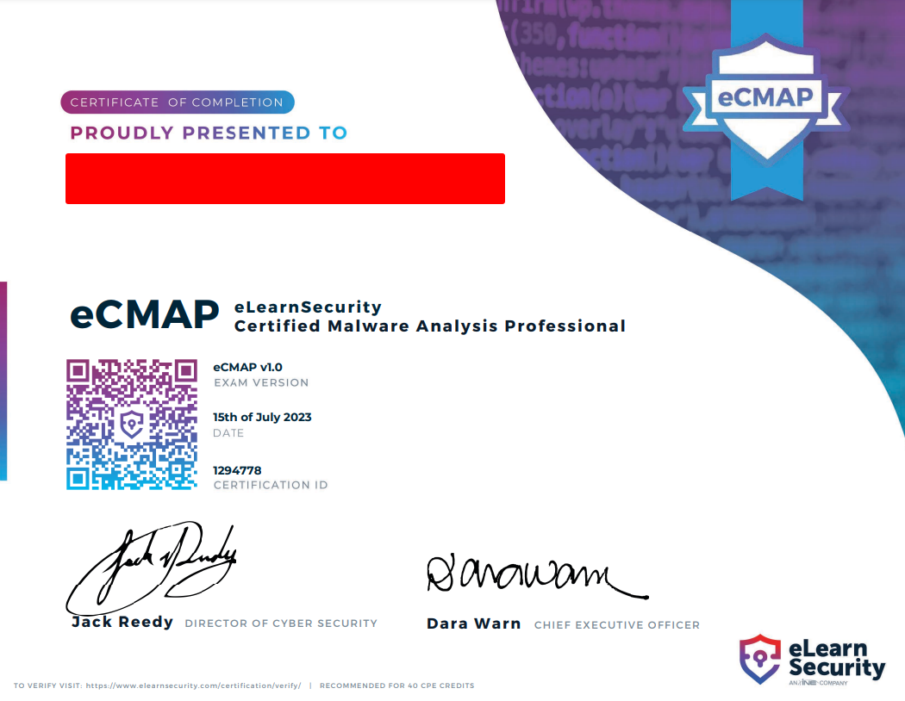
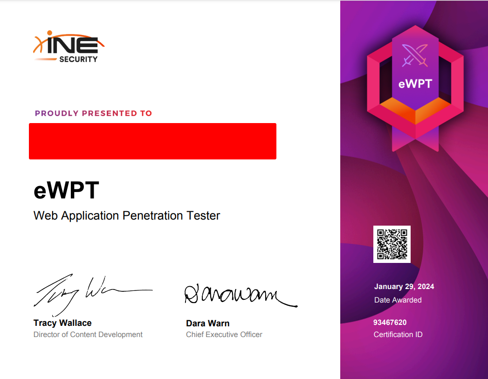

# Intro

I have been going through a lot of the INE/eLS courses and exams over the past year or so and decided to create a small overview and my general thoughts on them.

# eJPT

### Course

The eLearnSecurity Junior Penetration Tester was my first practical exam and my introduction to the world of practical exams.
I heard from my colleagues about eLearnSecurity and INE and after looking up some reviews I decided to go through the free (back then) course from INE.
The course was quite good, it goes over some basic tachniques and tools you want to have experience with as a pentester. Personally, I liked the combination of videos, slides and labs, which kept it interesting throughout my studies.

### Certification

As this was my first practical exam, I was a bit nervous and wasn't sure what to expect. I started the exam on a Saturday morning and was done with answering the questions within 4-5 hours.
I really enjoyed the exam and I thought it covered most, if not all of the material from the course.

I would definitely recommend the course and exam in the form and price they had when I completed them (free training + $150 for the exam).

# eCTHP

### Course
This was my first "serious" exam, so I decided to go through the course material twice. A lot of the knowledge from slides and vidoes was extremely useful, not just for the exam, but for my day job too.
Better understanding why and how the Cyber Kill Chain was used, getting deeper knowledge of Windows and its processes, understanding the Pyramid of Pain and better comprehending the MTRE ATT&CK TTPs and how to hunt for them was great.

### Certification
I want to say again that most of the material from the course was covered on the exam. The exam itself was very reminiscent of real-world tasks you'd have to do as a SOC analyst.
Without revealing what was on the exam, I would say it definitely was a great experience going through the exam scenarios and completing each of them.

As a whole I would definitely recommend the course and certificaiton for anyone on the blue side. It will give you a better overview of using different SIEMs and the part about hunting in memory what quite informative as well.
The only downside was the wait time to have my report reviewed - it took about 25-30 calendar days to receive feedback.

# eCPPT

### Course
I liked the course material, but wasn't very fond of the course structure - it begins with the "System Security" chapter, which should cover the Buffer Overflow information, but it just felt lacking to me. Instead I had to look for additional resources on the BoF exploitation. The rest of the course material was okay, although a bit outdated at this points.
A lot of the resources are linked in the #ptp-resources channel inside the ["Unofficial INE/eLS"](https://discord.com/invite/XGVaBeapXQ) discord server.

### Certification
After starting my exam the first time, everything was okay until I had to continue off of the first machine. I tried restarting the exam environment, but couldn't get it to start up again. I contacted the support team, which after asking me to try to start the environment a few times, were happy to provide me with a new exam voucher, to be applied on a different account (don't ask my why, but that's what happened lol).
On my second attemp, now from another account, I faced no issues with the environment and everything went smoothly. My report was reviewed and after only 2 days I received the congratulations email.

Overall the experience with the course and exam was very positive, my only gripe is that I had to go outside the course material to get information on the BoF.
I would definitely recommend this for blue teamers to get another perspective on things and some hands-on experience.

# eCMAP

### Course
The course material, although a bit dated, was extremely educational and walks you over all the details. It even has an assembly crash course, which is good to get you up to speed for the static portion of your analysis.
It also covers in good detail how to use a debugger (x32/x64 debugger) and how to collect information with different tools for the dynamic analysis portion.

### Certification
This was probably my most enjoyable certification exam from eLearnSecurit/INE. I learned quite a lot during the exam itself, especially for the anti-analysis techniques used by malware developer and how to bypass them.
~~As of writing this article, I'm still awaiting the results from my exam.~~  
Got my passing mark at last! Would definitely recommend the exam for anyone interested in malware analysis - the only problem is INE has decided to sunset the exam and learning path, which is sad to see.

# eCRE

### Course
I'm going over the course right now and so far like it quite a lot. It's clear the instructor knew what they were doing and they go into great detail with their explanations.

### Certification
Unfortunately due to my personal situation I was unable to sit the exam before it was retired by INE :(.

# eWPT

### Course
Went through most of the course material and while it does cover quite some basics, it is quite outdated. The course goes over the OWASP 2013... (current year 2023/4).
INE apparently made an updated course and released a new version of the exam, but it I won't be renewing my INE subscription or purchasing the same certification, just an updated version, any time soon.

### Certification
The certication was enjoyable, although again, while it covers the basics, it's still quite outdated. Personally happy to complete this exam, since web apps are not really my thing.

# Conclusion

So far so good. I've definetely enjoyed my eLearnSecurit/INE journey. My one regret is not being able to do eCRE.
Would I recommend for someone new getting into Cybersecurity to go for any of these certs? - not really. Unfortunately the content is getting very outdated and for the most part it's not maintained.
The labs are okay, but you can find better on other platforms. After retiring the more technical exams (like eCRE, eCMAP) the rest of the content doesn't give you all that much bang for your buck.
For now this concludes my journey with eLearnSecurity/INE, as I'll be moving on to get other certificaitons like the CRTP/E and CRTO, as well as some MCQ ones like Crowdstrike's.