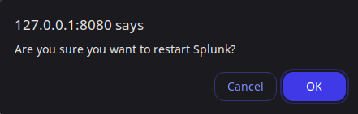

Sometime I find myself needing to analyse a particular set of data (usually structured data like json), but I don't have the tools ready on hand to do this.  
For this reason I've created an image of an Ubuntu 24.04 LTS server with Splunk installed to have in case this happens.  

The instance originally has a trial Splunk Enterprise license, but as I don't really need that most of the time, I change it to the free license Splunk provides.

Personally, I prefer VirtualBox for my VM needs, as it's open source and free, to use as my hypervisor.  
This is what I'll be using for this project. If you prefer or have another hypervisor, you can also use that instead!

# Install Ubuntu server VM

Go to - https://ubuntu.com/download/server and grab the latest 24.04 LTS iso. You can use another distro, although the installation steps may differ in the VM and Splunk installation parts.

Once downloaded, begin by sizing your VM.  
For mine I normally use:
- 2 vCPU 
- 8 GB of RAM
- 50 GB of Disk space


I choose the "Ubuntu Server option".


- Skip unattended installation.
- Leaving the default network configuration by VirtualBox (NAT in this case).
- For the purpose of this machine, use the entire disk when configuring the storage.
- Confirm the changes and setup an user account.
- I will install the SSH key later on.  
- For now only install the OpenSSH server.

Reboot and you're ready.

If it complains about a non-empty CD-ROM, check the Settings -> storage to make sure the installation `.iso` is gone and press `Enter`.

### Install SSH key

If you're going to bet using a NAT interface in VirtualBox you need to setup portforwarding.  

If that's not what you want, you can change to a Bridged adapted in **Setting** -> **Network**. This will put the VM in the same network as you host machine.

For now I'll create an SSH portforwarding rule.
The parameters:
- Host IP: 127.0.0.1
- Host Port: 2222
- (This is on your VM) Guest IP: 10.0.2.15
- Guest Port: 22 


 

Now install (put in `~/.ssh/authorized_keys`) your public SSH key onto the VM with the `ssh-copy-id` command.


# Install Splunk

Download Splunk deb package - http://www.splunk.com/download?r=header  
If you're using another distro, adjust the steps accordingly.

Example "Copy Wget":

```bash
wget -O splunk-9.4.0-6b4ebe426ca6-linux-amd64.deb "https://download.splunk.com/products/splunk/releases/9.4.0/linux/splunk-9.4.0-6b4ebe426ca6-linux-amd64.deb"
```

Next install the deb package with dpkg:

```bash
sudo dpkg -i splunk-4.3.4-136012-linux-2.6-amd64.deb
```


And now start the Splunk server.

```bash
cd /opt/splunk/bin
sudo ./splunk start
```

Accept the ToS, and create an admin-level user.  
I decide to keep my named `admin` for the sake of simplicity, and add a password for it.

`admin:password`

Next, again create a porforwarding rule, this time for Splunk's service on Guest:8000


Now got http://127.0.0.1:8080/ and Splunk should appear.


You could also save your credentials into the description of the VM, if you so choose, but I'd recommend using a password manager for that.


Additional information on Linux installation of Splunk can be found here - https://docs.splunk.com/Documentation/Splunk/9.4.0/Installation/InstallonLinux

You should also enable splunk on boot.

```bash
sudo ./splunk enable boot-start
```


If you prefer to switch to free license now, keep in mind the differences between Trial and Free license, described here - https://docs.splunk.com/Documentation/Splunk/latest/Admin/MoreaboutSplunkFree

Go to **Settings** -> **Licensing**




Lastly you have to switch off the VM to make export it.

```bash
sudo su -
poweroff
```

And now to create the VM image:
- Go to VirtualBox **File** -> **Export Appliance...**
- Select the VM from the lit
- Select where to save the `.ova` file


Finally, the VM has been exported and can be imported through the same options:
- **File** -> **Import Appliance..**
- Select the `.ova` file to import


Done!